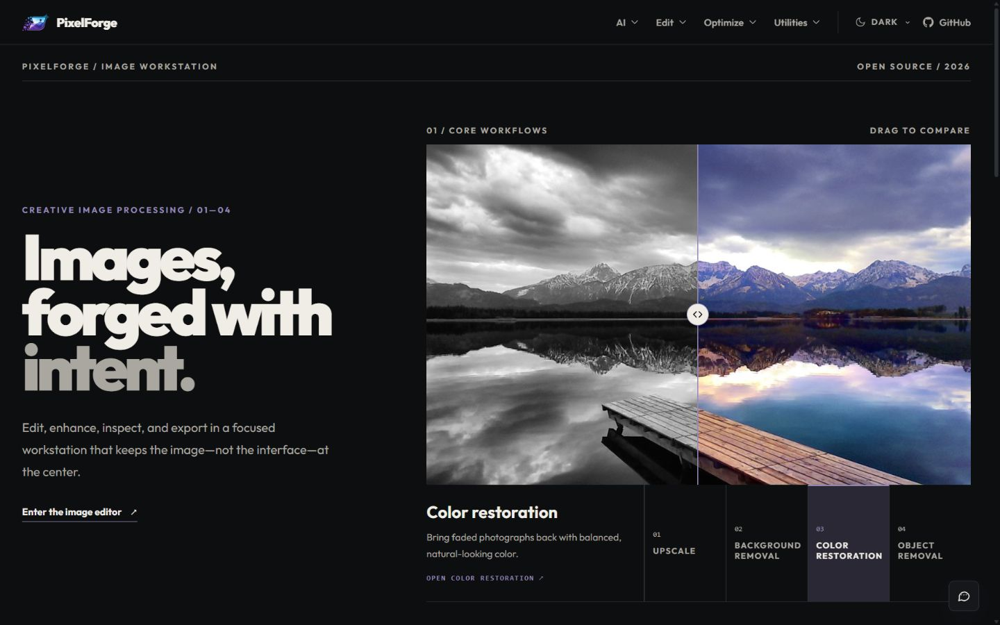
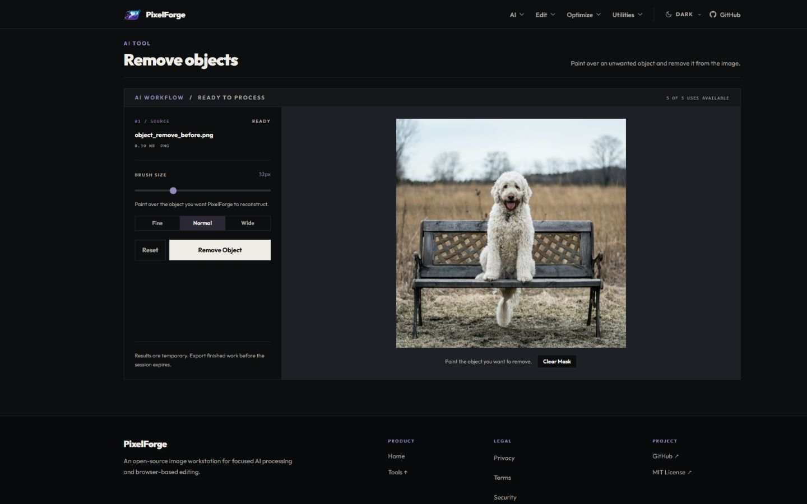
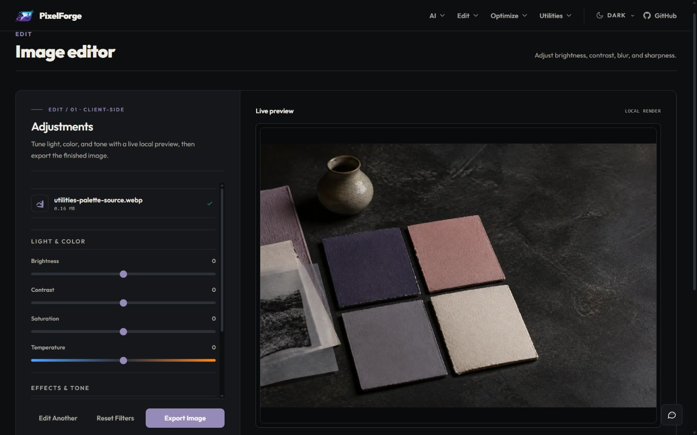

<div align="center">

  EN | [中文](./docs/translation/landing/README_CN.md) | [ID](./docs/translation/landing/README_ID.md)
</div>

<p align="center">
  <a href="https://github.com/Yoruxyv/PixelForge/actions/workflows/quality.yml"></a>
  
  
  
  
  
  
  
</p>

<p align="center" style="margin-top: -12px;">
  
  
</p>

<div align="center">

# ✨ PixelForge
### An open-source image-processing workstation for AI enhancement, browser editing, inspection, and export
</div>

## 🚀 Why PixelForge

<div style="max-width: 720px;">

PixelForge started as a single-purpose AI upscaler and evolved into a full-stack image-processing workstation.
It combines **AI-powered cloud processing** (upscale, background removal, restoration, object removal) with fast **client-side editing tools** (resize, compress, transform, metadata cleaning).
The system is designed to handle real-world constraints such as rate limits, long-running AI jobs, and storage lifecycle management through an async queue-based architecture.</div>

<br>

- ⚡ AI where it matters, instant client-side tools where it’s faster  
- 🔐 Security-first pipeline (Turnstile, signed URLs, validation, anti-spoof proxy strategy)  
- 🧠 Reliable architecture (async jobs, usage limits, janitor cleanup, session recovery)  
- 🎨 Image-first workspaces with before/after comparison and clear processing states  
- 🛠️ Open-source and extensible provider architecture  

## 🖼️ Product Preview

**Homepage — desktop, dark theme**



**AI object-removal workspace**



**Browser image editor**



## 🎯 Features

### AI workflows

- **Upscale Image** — increase resolution while preserving sharp details and clarity.
- **Remove Background** — create a clean, transparent subject cutout.
- **Restore Color** — bring grayscale or faded photos back with natural-looking color.
- **Remove Objects** — paint over an unwanted object and remove it from the image.

### Edit

- **Image Editor** — adjust brightness, contrast, saturation, blur, sharpness, and vignette.
- **Resize Image** — set exact dimensions with aspect-ratio locking and presets.
- **Crop Image** — reframe an image with freeform or preset aspect ratios.
- **Rotate & Flip** — correct orientation and composition with focused transform controls.

### Optimize

- **Compress Image** — reduce file size with direct quality control.
- **Convert Format** — export PNG, JPEG, or WebP images.
- **Remove Metadata** — strip EXIF and hidden metadata before sharing.

### Utilities and support

- **Color Palette** — sample an image and extract a practical working palette.
- **Add Watermark** — apply a text or image watermark with live preview.
- **PixelForge Assistant** — search the FAQ and open guided product shortcuts.
- **Feedback** — submit improvement ideas and bug reports from the application.

The responsive navigation uses a shared SVG tool-icon system rather than emoji or
external icon fonts. System, light, and dark themes share the same application
shell, and the browser/PWA identity includes optimized favicons, an Apple touch
icon, and 192 px/512 px install icons.

### Platform and system capabilities

- Turnstile verification, per-feature usage limits, and rate limiting
- Async AI jobs with queue capacity management and status polling
- IndexedDB/localStorage persistence and session restoration
- Signed Azure upload/result URLs and automated retention cleanup
- File type, size, spoofing, and resolution validation
- Browser-side downscaling for images above the public pixel limit
- Reusable image workspaces, comparison views, progress states, and export flows

## 🧠 Architecture Highlights
PixelForge is designed to balance performance, cost, and reliability while working with external AI APIs that have strict rate and concurrency limits. Key architectural decisions include:

- Queue-based AI processing system to handle long-running jobs  
- Decoupled upload → process → result pipeline  
- Concurrency control to prevent overload and API abuse  
- Stateless API with client-side job tracking  
- Hybrid processing model (AI in cloud, instant tools in browser)  
- Storage lifecycle management with automatic cleanup
- Pluggable AI provider layer for future model integrations

## 💡 Design Considerations

- AI jobs are handled asynchronously due to long execution times and external API limits  
- Polling is used instead of WebSockets for simplicity and reliability  
- Signed URLs reduce backend load and improve upload/download performance  
- Rate limiting and usage caps prevent abuse and control costs

## 🔧 Processing Models
PixelForge uses a hybrid processing model to balance performance and cost:
AI-intensive tasks are handled asynchronously on the backend, while lightweight operations are executed instantly in the browser.

<div style="max-width: 720px; line-height: 1.65; margin-left: 12px">

### 🔄 AI Processing Flow (Asynchronous)
The system separates processing paths based on workload type to optimize performance and cost :

1. User selects an image  
2. Frontend validates type, size, and resolution  
3. Oversized but safe images are resized in the browser before upload  
4. Backend verifies Turnstile and checks usage quota  
5. Backend generates signed upload URL metadata  
6. File uploads directly to Azure Blob Storage  
7. Backend reserves queue capacity and increments usage when processing starts  
8. AI provider executes the task asynchronously  
9. Client polls job status via API  
10. Result is stored with a signed access URL  
11. Cleanup system removes expired data
</div>

<div style="max-width: 720px; line-height: 1.65; margin-left: 12px">

### ⚡ Client-Side Processing Flow (Instant)
The frontend handles all lightweight transformations directly in the browser for instant feedback and zero backend load to provide a seamless user experience:

1. User uploads image  
2. Image processed directly in browser (resize, compress, transform, etc.)  
3. No backend interaction required  
4. Result generated instantly  
5. User downloads processed file
</div>

## 🏗️ Architecture & Stack


<div style="max-width: 760px; line-height: 1.65;">

PixelForge uses a split architecture:

- **Frontend (React + Vite + Tailwind CSS)**
  Handles theme-aware workspaces, SVG tool navigation, previews, client-side transforms, session persistence (IndexedDB/localStorage), and interaction flow. Vitest covers components and hooks; Playwright validates complete Chromium workflows.

- **Backend (FastAPI + asyncpg + aiohttp)**  
  Handles secure AI orchestration, Turnstile verification, usage/rate limits, signed upload/result URLs, and polling endpoints.

- **AI Inference (Replicate Python SDK)**  
  Model calls go through a provider abstraction (`BaseAIProvider` / `ReplicateProvider`) so the AI layer is modular and extensible.

- **Storage + Data (Azure Blob + PostgreSQL)**  
  Azure Blob manages upload/result lifecycle; PostgreSQL stores usage buckets and retention-driven state.

</div>

For more details, see [docs/ARCHITECTURE.md](docs/ARCHITECTURE.md).


## ⚙️ Environment Variables

PixelForge separates backend secrets from browser-visible frontend configuration. Create local environment files from the included examples:

```bash
cp backend/.env.example backend/.env
cp frontend/.env.example frontend/.env
```

> Windows PowerShell: use `Copy-Item backend/.env.example backend/.env` and `Copy-Item frontend/.env.example frontend/.env`.

### Backend (`backend/.env`)

```env
ENVIRONMENT=development

DATABASE_URL=postgresql://postgres@localhost:5432/pixelforge
AZURE_CONNECTION_STRING=
REPLICATE_API_TOKEN=
CLOUDFLARE_TURNSTILE_SECRET_KEY=
DISCORD_WEBHOOK_URL=
ALLOWED_ORIGINS=http://localhost:5173,http://127.0.0.1:5173
ALLOW_TURNSTILE_TEST_BYPASS=false

TRUST_PROXY_HEADERS=false
TRUSTED_PROXY_CIDRS=
CLOUDFLARE_SUBNETS=
REQUIRE_CLOUDFLARE_PROXY=false

LOG_LEVEL=INFO
LOG_TO_FILE=false
LOG_DIR=logs
LOG_FILE_NAME=pixelforge.log
LOG_MAX_BYTES=10485760
LOG_BACKUP_COUNT=5
```

### Frontend (`frontend/.env`)

```env
VITE_API_BASE_URL=http://127.0.0.1:8000/api
VITE_TURNSTILE_SITE_KEY=
VITE_DEBUG_API=true
```

- Keep `DATABASE_URL`, Azure credentials, Replicate tokens, the Turnstile secret, and `DISCORD_WEBHOOK_URL` only in the backend environment.
- All `VITE_*` values are bundled into browser code and must be safe to expose publicly.
- `VITE_DEBUG_API=true` enables API debug logging only during local Vite development; keep it `false` in production.
- `LOG_TO_FILE=false` is suitable when the hosting platform already captures stdout. Set it to `true` for local rotating file logs when needed.
- Forwarded IP headers are ignored by default. Enable `TRUST_PROXY_HEADERS` only with explicit proxy CIDRs; never use `0.0.0.0/0` or `::/0`.
- `CLOUDFLARE_SUBNETS` is required only for verified Cloudflare proxy mode. `REQUIRE_CLOUDFLARE_PROXY` validates the proxy chain but does not firewall the origin.
- For deployment, replace local origins and URLs with the hosted frontend and backend addresses.

Need help setting up external services? See [SETUP.md](./SETUP.md) for step-by-step instructions on configuring Azure Blob Storage, Replicate, Cloudflare Turnstile, PostgreSQL, Discord webhooks, and environment variables.

## 🚀 Local Development

### 1) Clone

```bash
git clone https://github.com/Yoruxyv/PixelForge.git
cd PixelForge
```

### 2) Start without Docker

Docker is optional. The launchers validate the local frontend dependencies,
install them from `package-lock.json` when missing or incomplete, synchronize
the backend environment from `uv.lock`, then start both development servers.
Node.js/npm and [uv](https://docs.astral.sh/uv/getting-started/installation/)
must already be installed.

Windows:

```bat
scripts\windows\start_app.bat
```

Linux and macOS:

```bash
./scripts/unix/start_app.sh
```

On later runs, existing dependencies are reused so the application starts
immediately. The frontend opens at `http://localhost:5173`; the backend runs at
`http://127.0.0.1:8000`.

### 3) Start manually

Backend:

Install [uv](https://docs.astral.sh/uv/getting-started/installation/) first. The
backend workflow is the same on Windows PowerShell, Linux, and macOS:

```bash
cd backend
uv sync --locked
uv run python run.py  # starts Uvicorn with proxy header rewriting disabled
```

Frontend:

```bash
cd frontend
npm install
npm run dev
```

### 4) Run the complete stack with Docker Compose

For a production-like local frontend, backend, and PostgreSQL stack, install
Docker Desktop or Docker Engine with Compose, then run:

```bash
cp .env.docker.example .env
docker compose up -d --build
```

Windows PowerShell: `Copy-Item .env.docker.example .env`.

Open `http://localhost:8080`, inspect the stack with `docker compose ps` or
`docker compose logs`, and stop it with `docker compose down`. PostgreSQL data
persists in a named volume. External AI workflows still require valid Azure,
Replicate, and Turnstile credentials in the root `.env` file.

See the [Docker Compose setup guide](SETUP.md#docker-compose-production-like-local-stack)
for configuration, networking, persistence, and troubleshooting details. Native
development remains available and does not require Docker.

### 5) Frontend quality checks

The same blocking frontend checks run in GitHub Actions. Install Playwright's
Chromium browser once before the first end-to-end run:

```bash
cd frontend
npm ci
npx playwright install chromium
npm run lint
npm run test -- --run
npm run build
npm run test:e2e
```

Use `npm run test:e2e:ui` when debugging Playwright scenarios interactively.
Failed CI runs upload the Playwright report, screenshots, and traces when they
are available.

### 6) Backend quality checks

```bash
cd backend
uv lock --check
uv sync --locked
uv run ruff check .
uv run ruff format --check .
uv run pytest
uv run mypy
```

### Continuous integration quality gate

Pull requests and pushes to `master` run:

- frontend ESLint, Vitest, production build, and Playwright Chromium tests;
- frontend Lighthouse against the production build/preview with 5 desktop and
  5 mobile runs: Performance arithmetic mean ≥ 95 per profile, every
  individual Performance run ≥ 90, and Accessibility, Best Practices, and SEO
  each equal to 100;
- backend dependency-lock validation, Ruff lint/format checks, pytest, and mypy;
- backend pytest compatibility on Python 3.11, 3.12, and 3.13;
- cross-platform script/tooling validation; and
- documentation link checking.

The aggregate **Quality gate** succeeds only when all required quality jobs,
including the Lighthouse budget, pass.

## 🔒 Security Notes

- Fresh Turnstile verification before every AI job initialization and feedback submission
- Forwarded client-IP headers accepted only from configured trusted proxy CIDRs
- Missing Turnstile configuration fails closed outside local/development environments
- Signed SAS URLs for controlled blob access
- Strict file validation + capped dimensions/size
- Public AI uploads use a lower browser-side pixel limit for user experience
- Backend validation remains the security boundary with a higher hard pixel safety cap
- Oversized images may be resized before upload, while oversized files are still rejected by byte-size limits
- Automated cleanup for privacy and storage hygiene


## 🤝 Contributing

PRs and improvements are welcome.  
If you’re planning a bigger change, open an issue first to align on scope.

For contributing guidelines, see [CONTRIBUTING.md](CONTRIBUTING.md).  
Please follow our [Code of Conduct](CODE_OF_CONDUCT.md).  
For security issues, please see our [Security Policy](SECURITY.md).

## 📜 License

Licensed under the MIT License. See [LICENSE](./LICENSE) for details.

## 📝 Developer Docs

How to add a new AI feature to PixelForge:
- [Adding a New AI Feature](docs/ADDING_AI_FEATURE.md)

Frontend, Playwright, backend, and AI testing guidance:
- [Testing PixelForge](docs/TESTING.md) ([ID](docs/translation/dev/TESTING_ID.md), [ZH](docs/translation/dev/TESTING_ZH.md))

Developer helper scripts:
- Total Line Counter: [PowerShell](scripts/windows/dev/get_total_lines.ps1) / [Bash](scripts/unix/dev/get_total_lines.sh)
- Application launcher: [Windows BAT](scripts/windows/start_app.bat) / [Bash](scripts/unix/start_app.sh)
- Usage reset helper: [Windows BAT](scripts/windows/reset_usage.bat) / [Bash](scripts/unix/reset_usage.sh)

The paired wrappers use shared project logic so Windows, Linux, and macOS follow
the same backend tooling behavior.

## 🙏 Acknowledgements

- Real-ESRGAN ecosystem
- Replicate platform
- FastAPI, React, and open-source contributors

## 👤 Contributors
Made with ❤️ by the PixelForge team:

<table>
  <tr>
    <td align="center" width="180">
      <a href="https://github.com/Yoruxyv">
        <br/>
        <b>Hans</b><br/>
      </a>
        <sub><b>Lead Developer</b></sub>
    </td>
    <td align="center" width="180">
      <a href="https://github.com/Serthonss">
        <br/>
        <b>Wellson</b><br/>
      </a>
        <sub><b>Project Coordinator</b></sub>
    </td>
    <td align="center" width="180">
      <a href="https://github.com/vincentlawi">
        <br/>
        <b>Lawi</b><br/>
      </a>
        <sub><b>UI/UX Designer</b></sub>
    </td>
    <td align="center" width="180">
      <a href="https://github.com/Jensenix">
        <br/>
        <b>Jensen</b><br/>
      </a>
        <sub><b>QA Lead & Stakeholder</b></sub>
    </td>
  </tr>
</table>
