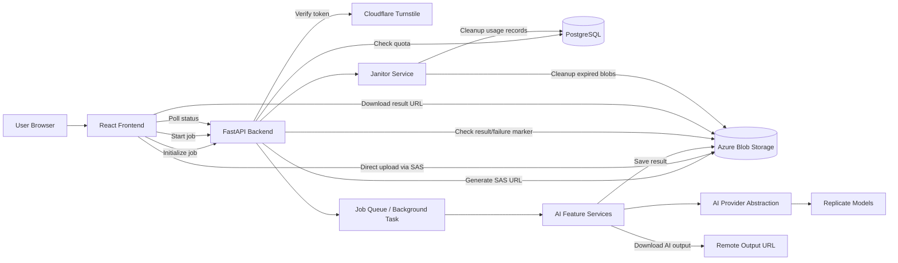
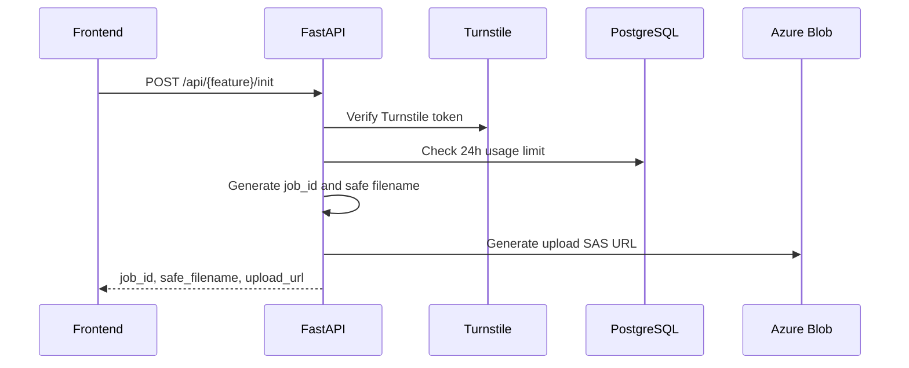
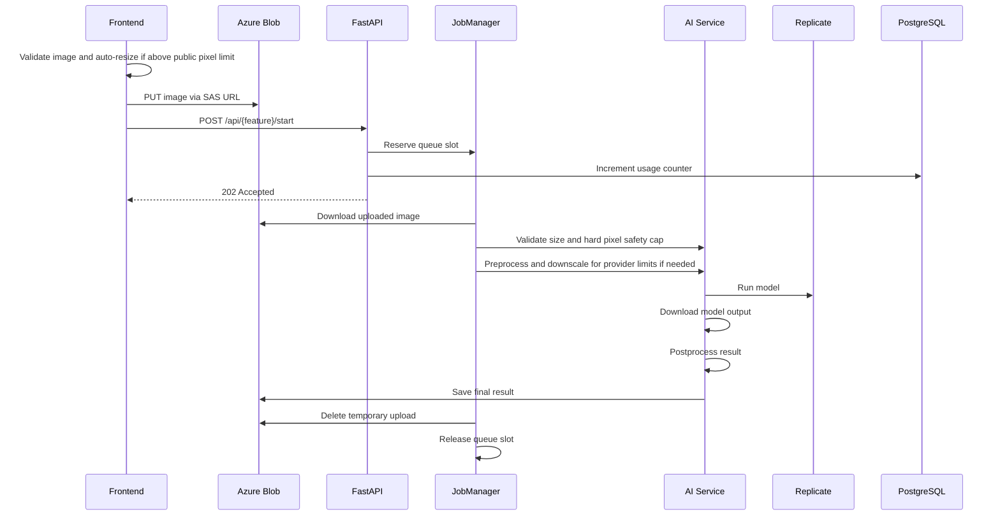
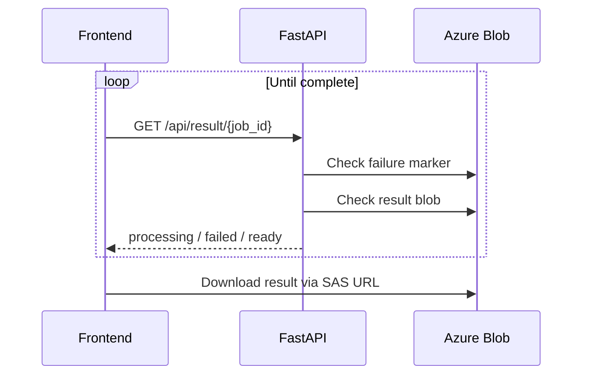
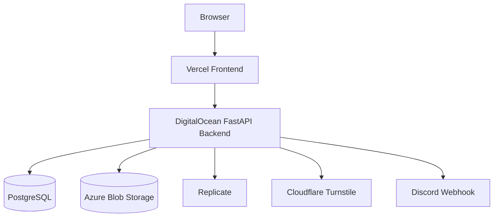

# PixelForge Architecture

PixelForge is an open-source image studio that provides browser-based image tools and AI-assisted image processing through a React frontend and FastAPI backend.

The system is designed around a clear split:

- **Frontend:** user interface, client-side tools, upload flow, progress UI, and polling.
- **Backend:** secure job initialization, usage limits, cloud upload URLs, AI job orchestration, provider execution, result storage, and cleanup.
- **Cloud services:** Azure Blob Storage for temporary uploads/results, Replicate for AI inference, PostgreSQL for usage tracking, Cloudflare Turnstile for bot protection, and Discord webhooks for feedback alerts.

---

## 1. High-Level System Overview



---

## 2. Technology Stack

### Frontend

- React
- Vite
- React Router
- Tailwind CSS
- Framer Motion
- Cloudflare Turnstile widget
- Client-side image utilities for non-AI tools

### Backend

- FastAPI
- Uvicorn
- Pydantic Settings
- SlowAPI rate limiting
- asyncpg
- Azure Blob Storage SDK
- Replicate Python SDK
- Pillow / image validation utilities
- httpx / aiohttp

### Infrastructure and External Services

- Azure Blob Storage
- PostgreSQL
- Replicate
- Cloudflare Turnstile
- Discord webhook
- Vercel frontend deployment
- DigitalOcean backend deployment

---

## 3. Repository Structure

```txt
PixelForge/
├── backend/
│   ├── api/
│   │   ├── routes/
│   │   └── schemas/
│   ├── app/
│   │   ├── factory.py
│   │   ├── lifecycle.py
│   │   ├── logging/
│   │   ├── middleware.py
│   │   └── routers.py
│   ├── core/
│   │   ├── config.py
│   │   ├── model_registry.py
│   │   └── security.py
│   ├── database/
│   │   └── db_pool.py
│   ├── domain/
│   │   └── ai_features.py
│   ├── limiter/
│   │   ├── rate_limiter.py
│   │   └── usage_service.py
│   ├── provider/
│   │   ├── ai_provider.py
│   │   └── replicate_client.py
│   ├── repository/
│   │   └── usage_repo.py
│   ├── services/
│   │   ├── ai/
│   │   ├── azure/
│   │   ├── job/
│   │   ├── maintenance/
│   │   ├── notification/
│   │   └── security/
│   ├── scripts/
│   └── utils/
│
├── frontend/
│   ├── src/
│   │   ├── app/
│   │   │   ├── landing/
│   │   │   ├── layout/
│   │   │   ├── navigation/
│   │   │   └── routing/
│   │   ├── features/
│   │   ├── shared/
│   │   │   ├── api/
│   │   │   ├── components/
│   │   │   ├── config/
│   │   │   ├── hooks/
│   │   │   ├── lib/
│   │   │   ├── storage/
│   │   │   └── validation/
│   │   ├── assets/
│   │   ├── main.jsx
│   │   └── index.css
│   ├── public/
│   └── vite.config.js
│
└── docs/
```

---

## 4. Frontend Architecture

The frontend is feature-layered. Application composition, product features, and
cross-feature platform code have separate owners:

```txt
main.jsx -> app -> features -> shared
```

`assets/` and `index.css` remain source-root resources. They do not own product
behavior.

### 4.1 `app`: composition

`frontend/src/app` owns the browser shell rather than tool behavior:

- `App.jsx` mounts the router, persistent layout, legal modals, and chatbot;
- `layout/` owns the global header, navigation, and footer;
- `landing/` owns the application landing/discovery page;
- `navigation/` owns route-discovery labels and links;
- `routing/` composes lazy route entries and application fallbacks.

Navigation categories such as AI, Smart Edit, Optimize, and Utilities are route
groups, not feature modules.

### 4.2 `features`: product ownership

Each folder under `frontend/src/features` owns one product capability. Its page,
controls, hooks, service adapter, validators, helpers, content, state, and tests
stay together when they change together.

Current feature roots include AI tools (`upscale`, `background-removal`,
`color-restoration`, and `object-removal`), browser tools (`image-editor`,
`resize`, `rotate-flip`, `compress`, `convert`, `metadata-removal`, `palette`,
`watermark`, and `crop`), plus `chatbot` and `feedback`.

Root-level feature page files are deliberate route entry points. A feature that
must be consumed by another feature exposes a small `index.js`; consumers must
not import a sibling feature's internal file.

### 4.3 `shared`: proven cross-feature code

`frontend/src/shared` contains responsibilities with multiple independent
consumers:

- `api/`: generic HTTP, Azure upload, and job polling transport;
- `components/ai/`: shared AI upload/process/result workspace presentation;
- `components/upload/` and `components/workspace/`: reusable browser-workspace UI;
- `config/`: shared validation, session, and AI fallback contracts;
- `hooks/`: shared upload, object URL, workspace, and AI lifecycle state;
- `lib/`: product-neutral file, image, and time helpers;
- `storage/`: IndexedDB and feature-scoped session persistence;
- `validation/`: browser upload validation and backend-runtime-limit fallback.

Code may enter `shared` only when current consumers prove that its responsibility
is independent of a single product feature. Similar-looking feature controls or
processing logic remain feature-owned unless their behavior and lifecycle are
actually the same.

### 4.4 Dependency rules

- `shared` must not import `app` or `features`.
- A feature may import `shared` and its own files.
- Cross-feature imports must target the other feature's explicit public
  `index.js`, never an internal module.
- `app` may import feature route entry points and feature public surfaces.
- Route files compose lazy feature entries; they do not own feature logic.
- Recursive barrel exports, central feature registries, and generic factories
  are not used without concrete need.

### 4.5 Adding a frontend feature

1. Create `frontend/src/features/<feature>/` with only the files the feature
   currently needs.
2. Keep its page, controls, hooks, service adapter, content, helpers, and tests
   inside that folder.
3. Reuse existing `shared` upload, validation, workspace, API, or lifecycle code
   only when the contract fits without feature-specific branching.
4. Add the lazy route entry under `frontend/src/app/routing/` and the discovery
   link under `frontend/src/app/navigation/` when applicable.
5. Add a small feature `index.js` only when another feature needs a deliberate
   public surface.
6. Verify route behavior, validation, processing, result, reset, and restoration
   flows, then run frontend lint, tests, and build.

AI-backed features share polling, Turnstile, usage, session, and result lifecycle
code. Browser-side features keep their canvas and processing logic local. The
backend remains the security and API-contract boundary.

---

## 5. Backend Architecture

The backend follows a layered FastAPI architecture.

```txt
app factory
   ↓
middleware + routers
   ↓
routes / schemas
   ↓
services
   ↓
provider / repository / storage
   ↓
external systems
```

---

### 5.1 Application Factory

The backend application is created through:

```txt
backend/app/factory.py
```

Responsibilities:

- Configure logging
- Validate critical environment settings
- Create the FastAPI app
- Register middleware
- Register routers
- Attach lifespan startup/shutdown behavior

---

### 5.2 Lifespan

Application lifecycle is managed in:

```txt
backend/app/lifecycle.py
```

Startup:

- Initialize PostgreSQL connection pool
- Start janitor background task

Shutdown:

- Cancel janitor task
- Close PostgreSQL pool

---

### 5.3 Middleware

Middleware is configured in:

```txt
backend/app/middleware.py
```

Configured behavior:

- Request logging
- CORS
- SlowAPI rate-limit exception handling

---

### 5.4 Routes

Routes are grouped by concern:

```txt
backend/api/routes/
├── router.py
├── ai_tools/
│   ├── upscale.py
│   ├── rembg.py
│   ├── color_restore.py
│   └── object_remove.py
├── jobs/
│   └── ai_jobs.py
├── ops/
│   └── health.py
└── public/
    └── feedback.py
```

Shared job endpoints:

| Endpoint | Purpose |
|---|---|
| `POST /{feature}/init` | Verify client, check quota, create job ID, return SAS upload URL |
| `POST /upscale/start` | Queue upscale job |
| `POST /rembg/start` | Queue background-removal job |
| `POST /colorrestore/start` | Queue color-restoration job |
| `POST /objectremove/start` | Queue object-removal job |
| `GET /result/{job_id}` | Check whether result is ready, failed, or processing |
| `GET /usage?feature=...` | Return current usage status |
| `POST /feedback` | Submit feedback to Discord webhook |
| `GET /` | Health check |

---

## 6. AI Job Lifecycle

AI jobs use a three-phase workflow.

### Phase 1: Initialize



Initialization does not run the AI model. It only prepares a secure upload and validates that the request is allowed.

Initialization checks whether usage is still available, but it does not consume usage. Usage is reserved when the job is started, after the upload step.

Turnstile verification is performed on every initialization request. The token is single-use in the application flow and is reset before a later job.

---

### Phase 2: Upload and Start



---

### Phase 3: Poll Result



---

## 7. AI Feature Service Layer

AI feature services live under:

```txt
backend/services/ai/
├── features/
│   ├── upscale.py
│   ├── bg_remover.py
│   ├── color_restorer.py
│   └── object_remover.py
└── pipeline/
    └── image_pipeline_service.py
```

All AI features share `ImagePipelineService`, which implements the template method pipeline:

1. Download upload bytes from Azure
2. Validate input byte size
3. Validate input resolution against the backend hard safety cap
4. Preprocess input and downscale for provider limits when needed
5. Execute remote model
6. Download remote result
7. Postprocess output
8. Validate output size
9. Save final result to Azure

Feature services override only the parts they need:

| Service | Special Behavior |
|---|---|
| `AIUpscaler` | Downscale before model, compress/cap output |
| `BackgroundRemover` | Downscale input, output WEBP with alpha |
| `ColorRestorer` | Validate grayscale input before model |
| `ObjectRemover` | Load mask image and pass image + mask to model |

---

## 8. Provider Architecture

The AI provider abstraction lives in:

```txt
backend/provider/
├── ai_provider.py
└── replicate_client.py
```

`BaseAIProvider` defines the provider contract.

`ReplicateProvider` implements that contract using Replicate.

This design allows a future provider, such as RunPod or another inference service, to be added without rewriting feature services.

---

## 9. Model Registry

Model identifiers and provider-specific keys are centralized in:

```txt
backend/core/model_registry.py
```

The registry stores:

- Replicate model IDs
- Default model parameters
- Input key names
- Mask key names for object removal

This avoids scattering provider details throughout the application.

---

## 10. Storage Architecture

Azure Blob Storage is managed through:

```txt
backend/services/azure/
├── storage.py
└── storage_utils.py
```

The backend uses two containers:

| Container | Purpose |
|---|---|
| `uploads` | Temporary source images and object-removal masks |
| `results` | Processed AI outputs and failure markers |

Storage responsibilities:

- Generate write-only upload SAS URLs
- Generate read-only result SAS URLs
- Download uploaded files for backend processing
- Save processed results
- Delete temporary uploads
- Store failure markers
- Cleanup expired results

---

## 11. Usage Limits and Rate Limiting

Usage tracking is split across:

```txt
backend/limiter/
├── rate_limiter.py
└── usage_service.py

backend/repository/
└── usage_repo.py
```

### Rate Limiting

SlowAPI rate-limits requests using the client IP returned by `get_real_client_ip()`.

Client IP resolution is fail-closed:

1. When `TRUST_PROXY_HEADERS=false`, forwarded headers are ignored and the direct socket peer (`request.client.host`) is used.
2. When proxy trust is enabled, the direct peer must belong to `TRUSTED_PROXY_CIDRS` or `CLOUDFLARE_SUBNETS`; otherwise `CF-Connecting-IP`, `X-Forwarded-For`, and `X-Real-IP` are ignored.
3. `CF-Connecting-IP` is accepted only when the direct peer is a verified Cloudflare address.
4. Otherwise, `X-Forwarded-For` is evaluated from right to left. Only configured trusted proxy hops are skipped, and the first untrusted address is treated as the client.
5. `X-Real-IP` is used only as a final fallback from an allowlisted proxy.
6. Malformed IP addresses and invalid CIDRs are ignored and logged.

Local development should use `python run.py`; the runner starts Uvicorn with `proxy_headers=False` so the application resolver receives the real socket peer instead of a value already rewritten by the server. The equivalent direct command is `uvicorn main:app --reload --no-proxy-headers`. Never trust `0.0.0.0/0`, `::/0`, or an unrestricted forwarded-header configuration.

When PixelForge runs behind a managed platform and proxy trust is disabled, multiple visitors may appear under the platform's shared proxy address. This is resistant to spoofed headers but can make per-IP rate and usage limits less precise. Proxy trust should be enabled only after the platform's direct proxy CIDRs and forwarded-header behavior are verified.

### Usage Limits

Usage is currently tracked per resolved IP and feature:

```txt
{client_ip}:{feature}
```

Usage records are stored by hour in:

```sql
ip_usage_hourly
```

This supports rolling 24-hour usage windows while keeping cleanup simple. Because the current identity is IP-based, users behind the same NAT, carrier network, or reverse proxy can share a quota, while one user can receive a different identity after changing networks.

---
## 12. Queue and Job Management

Job orchestration is handled by:

```txt
backend/services/job/
├── job_initializer.py
├── job_dispatcher.py
├── job_manager.py
└── queue_service.py
```

### JobInitializer

Prepares jobs before processing:

- Verify Turnstile
- Check daily usage
- Generate job ID
- Generate safe filenames
- Generate upload SAS URLs

### JobDispatcher

Used by route handlers to:

- Resolve client IP
- Reserve queue capacity
- Add background task
- Return consistent `202 Accepted` response

### JobManager

Owns the processing lifecycle:

- Reserve queue slot
- Increment usage
- Execute feature service
- Delete temporary upload
- Mark failed jobs
- Refund usage on failure
- Release queue slot

### QueueService

Tracks active jobs in-process and prevents overloading the backend process.

---

## 13. Security Architecture

PixelForge security focuses on limiting abuse, unsafe uploads, and accidental exposure.

### Bot Protection

Cloudflare Turnstile protects every AI job initialization and every feedback submission.

Each `POST /api/{feature}/init` request must include a fresh Turnstile token, and the backend verifies that token with Cloudflare before checking quota or issuing upload metadata. A previous successful verification does not create a reusable approval. The frontend resets the token after completion, cancellation, or failure so the next job obtains a new token.

Feedback submission performs its own Turnstile verification. A manual bypass exists only for explicitly enabled local/development environments. In production, a missing Turnstile secret is treated as a configuration error and verification fails closed.

### File Safety

The backend validates and limits uploaded data through:

- MIME/type validation
- Safe generated filenames
- File size limits
- Public upload resolution limits
- Backend hard pixel safety limits
- Provider-oriented downscaling before AI execution
- Controlled CPU concurrency
- Azure SAS expiration

### Storage Safety

The frontend uploads directly to Azure using short-lived SAS URLs. The backend generates filenames using job IDs, avoiding trust in client-provided paths.

### Usage Protection

Feature usage limits prevent unlimited AI calls from a single client.

### Cleanup

Temporary uploads and results are deleted automatically by the job flow and janitor service.

---

## 14. Feedback Flow

Feedback submission uses:

```txt
frontend feedback form
   ↓
POST /api/feedback
   ↓
Turnstile verification
   ↓
usage/rate limit
   ↓
Discord webhook
```

The feedback service builds a Discord embed and sends it asynchronously.

---

## 15. Logging

Logging is configured in:

```txt
backend/app/logging/
├── logging_config.py
├── logging_formatter.py
└── request_logging.py
```

Logging features:

- Consistent timestamp/severity/component format
- Console output
- Optional rotating file logs
- Reduced noise from third-party libraries
- Request duration logging

Example log shape:

```txt
2026-01-01 12:00:00 | INFO     | job-manager            | upscale done job=...
```

---

## 16. Cleanup and Maintenance

The janitor service runs in the application lifespan.

Responsibilities:

- Remove expired Azure result blobs
- Remove old usage tracking records

The local development reset script:

```txt
backend/scripts/reset_usage.py
```

resets usage counters only in the allowed development environment.

---

## 17. Environment Configuration

Runtime configuration is centralized in:

```txt
backend/core/config.py
```

Important backend environment variables:

```txt
DATABASE_URL
AZURE_CONNECTION_STRING
REPLICATE_API_TOKEN
CLOUDFLARE_TURNSTILE_SECRET_KEY
DISCORD_WEBHOOK_URL
ALLOWED_ORIGINS

ENVIRONMENT
ALLOW_TURNSTILE_TEST_BYPASS

TRUST_PROXY_HEADERS
TRUSTED_PROXY_CIDRS
CLOUDFLARE_SUBNETS
REQUIRE_CLOUDFLARE_PROXY

LOG_LEVEL
LOG_TO_FILE
LOG_DIR
LOG_FILE_NAME
LOG_MAX_BYTES
LOG_BACKUP_COUNT
```

Important frontend environment variables:

```txt
VITE_API_BASE_URL
VITE_TURNSTILE_SITE_KEY
VITE_DEBUG_API
```

The Turnstile site key is public frontend configuration. The Turnstile secret key, provider credentials, database URL, Azure connection string, and Discord webhook URL must remain backend-only.

Safe proxy defaults are:

```env
TRUST_PROXY_HEADERS=false
TRUSTED_PROXY_CIDRS=
CLOUDFLARE_SUBNETS=
REQUIRE_CLOUDFLARE_PROXY=false
```

Important limits:

```txt
UPLOAD_RATE_LIMIT
POLL_RATE_LIMIT
FEEDBACK_RATE_LIMIT

UPSCALE_DAILY_USAGE_LIMIT
REMBG_DAILY_USAGE_LIMIT
COLOR_RESTORE_DAILY_USAGE_LIMIT
OBJECT_REMOVE_DAILY_USAGE_LIMIT
FEEDBACK_DAILY_USAGE_LIMIT

MAX_FILE_SIZE_MB
MAX_MEGAPIXELS
MAX_IMAGE_DIMENSION
MAX_CONCURRENT_JOBS
MAX_CONCURRENT_CPU_JOBS
```

---
## 18. Deployment Model



Frontend and backend are deployed separately.

The frontend calls the backend through the configured API base URL. The backend handles CORS using configured allowed origins.

---

## 19. Design Principles

PixelForge follows these architecture principles:

1. **Thin routes**
   Route handlers validate request shape and delegate to services.

2. **Shared pipelines**
   Repeated AI workflow logic lives in the shared image pipeline.

3. **Feature-specific hooks**
   Frontend feature pages remain readable by delegating API workflow to hooks.

4. **Provider abstraction**
   AI services do not depend directly on Replicate-specific code.

5. **Secure temporary storage**
   Uploads and results are short-lived and cleanup-aware.

6. **Fail-safe cleanup**
   Failed jobs create markers, refund usage, and release queue slots.

7. **Local development safety**
   Destructive scripts are guarded by environment checks.

---

## 20. Adding a New AI Feature

To add a new AI feature:

1. Add the feature key to the backend domain type.
2. Add the usage limit to settings.
3. Register the model in `ModelRegistry`.
4. Create a feature service under `services/ai/features`.
5. Add request schemas if needed.
6. Add a route under `api/routes/ai_tools`.
7. Include the route in the central API router.
8. Add frontend service/action hook.
9. Add frontend pipeline hook.
10. Add feature page and controls.
11. Add navigation and marketing data.
12. Add usage/progress labels.

Recommended pattern:

```txt
backend feature service
   ↓
backend route
   ↓
frontend service function
   ↓
frontend action hook
   ↓
frontend pipeline hook
   ↓
frontend page
```

---

## 21. Known Architecture Notes

- `QueueService` is process-local. If the backend runs multiple instances, each instance has its own queue counter.
- Azure SAS URLs are short-lived and should not be stored long-term.
- The frontend should not send secrets. All provider tokens and Azure credentials stay backend-side.
- Client-side tools should remain browser-only unless they require AI processing.
- Direct upload keeps large file transfer off the backend request body path.

---

## 22. Documentation Map

PixelForge documentation is grouped by audience and purpose.

```txt
Root community docs:
README.md
CONTRIBUTING.md
CODE_OF_CONDUCT.md
SECURITY.md
LICENSE

Developer docs:
docs/
├── ARCHITECTURE.md
├── ADDING_AI_FEATURE.md
├── TESTING.md
├── assets/
│   ├── TECH_STACKS.png
│   └── tech_stacks_generator.html
└── translation/
    ├── landing/
    │   ├── README_ID.md
    │   └── README_CN.md
    ├── dev/
    │   ├── ADDING_AI_FEATURE_ID.md
    │   ├── ADDING_AI_FEATURE_ZH.md
    │   ├── ARCHITECTURE_ID.md
    │   ├── ARCHITECTURE_ZH.md
    │   ├── SETUP_ID.md
    │   ├── SETUP_ZH.md
    │   ├── TESTING_ID.md
    │   └── TESTING_ZH.md
    └── community/
        ├── CONTRIBUTING_ID.md
        ├── CONTRIBUTING_ZH.md
        ├── CODE_OF_CONDUCT_ID.md
        ├── CODE_OF_CONDUCT_ZH.md
        ├── SECURITY_ID.md
        └── SECURITY_ZH.md
```

Recommended future docs:

```txt
docs/
├── API.md
└── DEPLOYMENT.md
```

`ARCHITECTURE.md` should remain high-level. Implementation details should live in module docstrings and feature-specific guides.
